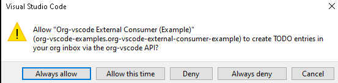
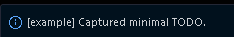
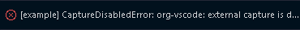

# org-vscode External API (v1)

This document describes the public API exposed by the `realDestroyer.org-vscode`
VS Code extension for use by other extensions. The API is **disabled by
default** and gated by per-workspace, per-caller user consent.

> **Status:** experimental. Feedback welcome via
> [issue #110](https://github.com/realDestroyer/org-vscode/issues/110)
> and in `SECURITY.md` for security-sensitive observations.

> **Reference consumer:** A runnable example extension lives at
> [`examples/external-consumer/`](../examples/external-consumer/README.md).
> It demonstrates the email-capture pattern from issue #110 in ~120 lines
> and is the recommended starting point for new integrations.

---

## Quickstart

The fastest way to see the API in action is to run org-vscode side-by-side
with the example consumer:

```powershell
cd path\to\org-vscode
npm run bundle
code `
  --extensionDevelopmentPath="$PWD" `
  --extensionDevelopmentPath="$PWD\examples\external-consumer" `
  "..\OrgFiles"
```

Then in the new window:

1. Set `Org-vscode.enableExternalCapture` to `true` and point
   `Org-vscode.captureInboxFile` at a writable `.org` file.
2. Run **Org Consumer Example: Capture Minimal TODO** from the palette.

The first call from any new extension (including the example) surfaces a
modal trust prompt:



Picking **Always allow** persists the decision in workspace state. Subsequent
calls from the same extension are silent. Choosing **Always deny** persists
the rejection. Choosing **Allow this time** / **Deny** / cancelling does not
persist.

After the first successful capture you'll see a confirmation toast:



Toggling `Org-vscode.enableExternalCapture` back to `false` immediately blocks
all external callers (and the palette command) regardless of past trust
decisions:



---

## When to use this API

Use this API if your extension wants to:

- Push a structured TODO into the user's org inbox (e.g. "remind me about this
  email", "open a follow-up task from this PR").
- Make a custom link scheme like `[[msgid:abc@host]]` clickable inside `.org`
  / `.vsorg` / `.org-vscode` documents and route the click back to your
  extension.

If you only need to insert plain text into a file, use VS Code's normal text
editing APIs &mdash; you do not need this surface.

---

## Enabling the API

The user must opt in **per workspace** by setting:

```json
{
  "Org-vscode.enableExternalCapture": true
}
```

The first call from your extension to `registerLinkType` or `captureTodo`
prompts the user with:

> Allow "&lt;your display name&gt;" (`publisher.name`) to register a custom
> org link scheme / create TODO entries in your org inbox via the org-vscode
> API?

Choices:

| Choice            | Effect                                                                  |
| ----------------- | ----------------------------------------------------------------------- |
| Always allow      | Stores `allow` in workspace state. No future prompts for that capability. |
| Allow this time   | Allows the current call. Re-prompts on the next call.                   |
| Deny              | Denies the current call. Re-prompts on the next call.                   |
| Always deny       | Stores `deny` in workspace state. All future calls reject.              |

Decisions are **per-capability** (`registerLinkType` and `captureTodo` are
separate) and stored in `workspaceState`, never `globalState`. Approving an
extension in one workspace does not grant it rights in any other workspace.

---

## Acquiring the API

```ts
import * as vscode from "vscode";

const orgExt = vscode.extensions.getExtension("realDestroyer.org-vscode");
if (!orgExt) return;
await orgExt.activate();
const orgApi = orgExt.exports;
if (!orgApi || typeof orgApi.registerLinkType !== "function") return;
```

---

## `orgApi.version`

`string` &mdash; the org-vscode extension's `package.json` version. Use to
gate features when the API surface evolves.

---

## `orgApi.registerLinkType(handler)`

Register a custom org link scheme. Returns a `Thenable<vscode.Disposable>`.
Reject with `TrustDeniedError` if the user denies access. Reject with
`Error` (code `ORG_VSCODE_INVALID_HANDLER`) for malformed handlers, or
`ORG_VSCODE_SCHEME_TAKEN` if another extension already owns that scheme.

### Handler shape

```ts
interface LinkTypeHandler {
  type: string;                  // lowercase scheme, e.g. "msgid"
  description?: string;
  pattern?: RegExp;              // optional advisory pattern (not enforced)
  resolve(path: string, ctx: LinkContext): LinkResolution;
  complete?(prefix: string, ctx: LinkContext): Promise<LinkCompletion[]> | LinkCompletion[];
}

interface LinkContext {
  filePath?: string;             // absolute fsPath of the org document
  rootDir?: string;              // dirname of filePath
}

interface LinkResolution {
  displayText?: string;
  url?: string;                  // see scheme allowlist below
  tooltip?: string;
  exists?: boolean;
  metadata?: Record<string, unknown>;
}

interface LinkCompletion {
  text: string;                  // inserted text (without scheme prefix)
  label?: string;
  detail?: string;
  sortPriority?: number;
}
```

### URL scheme allowlist

For safety, org-vscode only follows links whose `resolution.url` starts with
one of: `http:`, `https:`, `mailto:`, `vscode:`, `vscode-insiders:`, or
`command:`. Anything else is rendered as a no-op clickable link with the
handler's tooltip displayed; the user can copy the bracketed link target
manually.

If your extension owns a `command:` URI, register that command in your own
extension; org-vscode does not proxy command invocations.

### Reserved schemes

The following schemes are reserved by org-vscode and cannot be registered:
`http`, `https`, `mailto`, `file`, `id`, `*`, `#`.

### Example

```ts
const disposable = await orgApi.registerLinkType({
  type: "msgid",
  description: "Email Message-ID links",
  pattern: /^[^\s<>]+@[^\s<>]+$/,
  resolve(path, ctx) {
    return {
      displayText: `Email: ${path}`,
      url: `command:my-mail-client.openMessage?${encodeURIComponent(JSON.stringify({ msgid: path }))}`,
      tooltip: `Open ${path} in My Mail Client`
    };
  }
});

context.subscriptions.push(disposable);
```

---

## `orgApi.captureTodo(payload)`

Append a structured TODO entry to the configured inbox file. Returns
`Thenable<{ uri: string; line: number }>`.

Throws:

- `CaptureDisabledError` (code `ORG_VSCODE_CAPTURE_DISABLED`) if
  `Org-vscode.enableExternalCapture` is `false`.
- `TrustDeniedError` (code `ORG_VSCODE_TRUST_DENIED`) if the user denies.
- `CaptureValidationError` (code `ORG_VSCODE_CAPTURE_INVALID`) if the
  payload is malformed.
- Generic `Error` if the inbox path resolves outside the workspace, has the
  wrong extension, or cannot be written.

### Payload

```ts
interface CapturePayload {
  headline: string;                  // required, single line, max 500 chars
  state?: string;                    // workflow keyword, default "TODO"
  tags?: string[];                   // org tag charset only, max 32
  scheduled?: string;                // "YYYY-MM-DD" or "YYYY-MM-DD HH:MM" or "<...>"
  deadline?: string;
  properties?: Record<string, string>; // keys [A-Z][A-Z0-9_-]*; CAPTURED / CAPTURED_BY are reserved
  body?: string;                     // max 8000 chars
  link?: string;                     // bracketed: "[[mailto:a@b][a@b]]"
}
```

### Sanitization & rejection rules

- `#+BEGIN_SRC` is rejected anywhere in `headline` or `body` (defense
  against the Execute Src Block CodeLens path).
- Links of the form `[[file:...]]`, `[[id:...]]`, `[[*heading]]`,
  `[[#anchor]]` are rejected in `headline`, `body`, and the standalone
  `link` field.
- Control characters (C0/C1) are stripped. Newlines are preserved in
  `body` only.
- Field length caps are enforced (see source for current values).

Captured entries always carry:

- A `:CAPTURED:` property timestamp
- A `:CAPTURED_BY:` property identifying the calling extension id
- These two property keys cannot be overridden by the payload.

### Example

```ts
const result = await orgApi.captureTodo({
  headline: "Reply to RFP from Customer X",
  state: "TODO",
  tags: ["email", "customer-x"],
  scheduled: "2026-04-30",
  properties: {
    MSGID: "<abc-123@mail.example>",
    FROM: "rfp@example.com",
    SUBJECT: "RFP 2026-Q2"
  },
  body: "See attached PDF; respond by EOD Friday.",
  link: "[[mailto:rfp@example.com][rfp@example.com]]"
});

// result.uri is a file:// URI to the inbox; result.line is the 0-based line.
```

---

## `orgApi.getCapturedSchemes()`

Returns `string[]` &mdash; the lowercase scheme names currently registered
across all callers. Diagnostics only; the return value is a snapshot, not
a live view.

---

## Configuration reference

| Setting                                  | Default        | Purpose |
| ---------------------------------------- | -------------- | ------- |
| `Org-vscode.enableExternalCapture`       | `false`        | Master kill switch for `captureTodo` and the API trust prompt. |
| `Org-vscode.captureInboxFile`            | `""` (→ `<workspace>/inbox.org`) | Target file. Must be inside the workspace and end in `.org` or `.vsorg`. |
| `Org-vscode.captureTargetHeading`        | `"* Inbox"`    | Heading under which captures are appended (created if missing). |
| `Org-vscode.disableSrcExecutionInPaths`  | `["inbox.org"]`| Files where Execute Src Block is suppressed. |
| `Org-vscode.debugExternalApi`            | `false`        | When enabled, logs caller-identification diagnostics (call stack, known extension roots) to the Extension Host console when the API cannot identify the caller. Useful for filing bug reports. |

---

## Versioning policy

This API follows semantic versioning aligned with the extension's
`package.json` version:

- **Patch:** bug fixes, additional sanitization rules, additional warnings.
- **Minor:** new optional fields, new methods, new accepted scheme prefixes.
- **Major:** breaking changes to existing method signatures or trust model.

Pin against `orgApi.version` if you depend on a specific feature.
